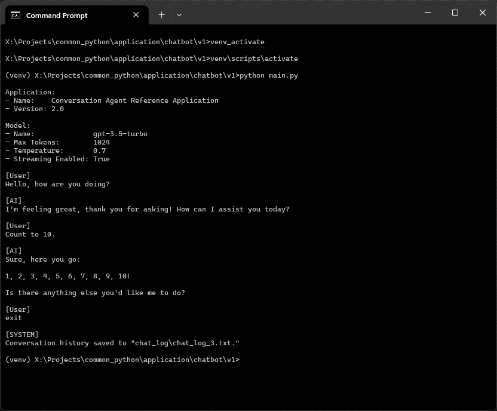
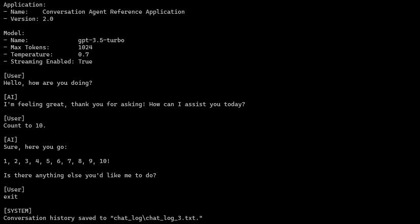
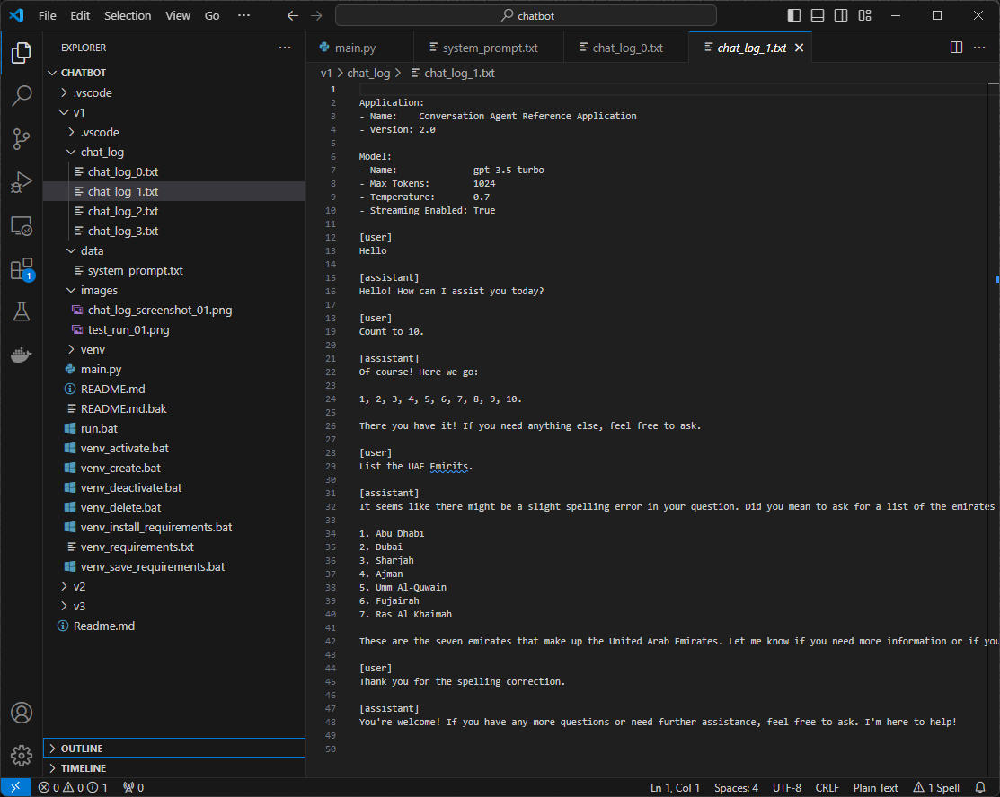

# OpenAI GPT Chatbot — Reference Application
**Version:** 1.0 (Procedural version)

[](https://www.python.org/)
[](https://platform.openai.com/docs/overview)



General purpose OpenAI GPT API reference application, demonstrating the basic layout and features of a LLM based chatgpt with conversation history, user commands, and saving to chat log file.

## 📑 Table of Contents

1. [✨ Features](#-features)
2. [🚀 Usage](#-usage)
3. [🔧 Installation](#-installation)
4. [📄 License](#-license)

## ✨ Features

- Terminal hosted tern-based chatbot. 
- Conversation history maintained during conversation.
- Terminal command manager.
- System prompt loaded from text file. 
- Chat log saved to text file.

## 🚀 Usage

All source code and tooling live in the `src` folder, so the program is run from there. Open a terminal in `src`, activate the Python virtual environment, and then run the program with `python main.py` or the `run.bat` batch file:

```sh
cd src
venv_activate.bat
run.bat
``` 



The chat log is saved to a text file after exiting the program.




## 🔧 Installation

### Prerequisites

- Python 3.x
- OpenAI API
  
  - `pip install --upgrade openai`
  
    or

  - `pip install openai`

    or

  - use the `venv_install_requirements.bat` batch file, which will `pip install` the dependencies from the `venv_requirements.txt` file. 

### Clone repository

1. Clone the repository:

    ```sh
    git clone https://github.com/your-username/your-repo.git
    ```

2. Navigate to the project directory:

    ```sh
    cd your-repo
    ```

### Python Virtual Environment Setup

3. Open a terminal in the `src` folder, where the source, batch files, and dependency manifests now live:

    ```sh
    cd src
    ```

4. Create and activate the virtual environment using the provided batch files:

   If you are using Windows, for the sake of convenience, a set of `venv_*.bat` batch files is provided to create, manage and maintain the Python virtual environment.

    - To create the virtual environment and activate it, run:

      ```sh
      venv_create.bat
      ```

    - If you need to activate the virtual environment later, run:

      ```sh
      venv_activate.bat
      ```

    - To deactivate the virtual environment, run:

      ```sh
      venv_deactivate.bat
      ```

    - To delete the virtual environment, run:

      ```sh
      venv_delete.bat
      ```

5. Install the required packages:

    ```sh
    venv_install_requirements.bat
    ```

6. To save the current list of installed packages to `venv_requirements.txt`, run:

    ```sh
    venv_save_requirements.bat
    ```

## 📄 License

Released under the [MIT License](LICENSE) — Copyright © 2024 Rohin Gosling.